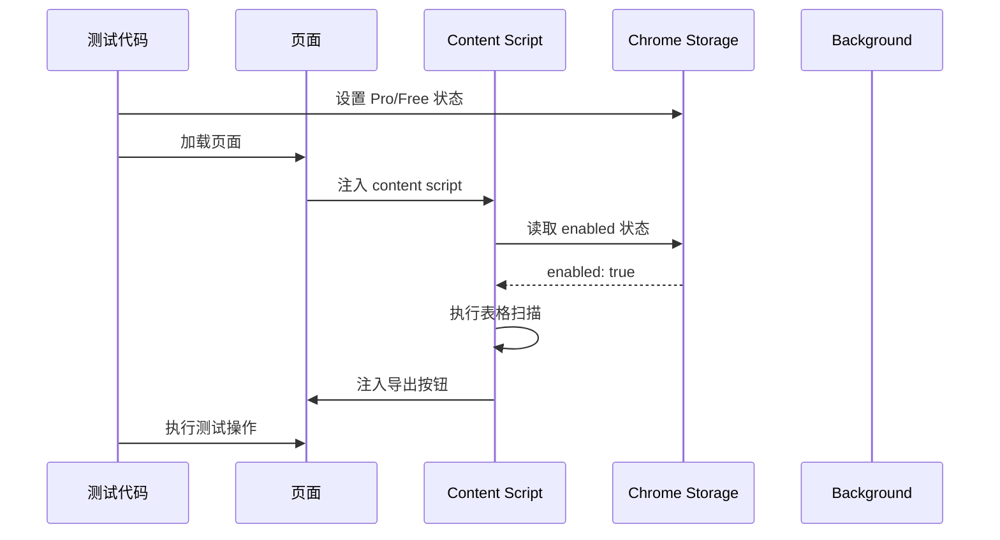

# 技术设计文档：修复集成测试

## 概述

本设计文档针对39个失败的集成测试提供系统性修复方案。核心问题是插件初始化时序不匹配：插件默认禁用状态（`enabled: false`）导致测试环境中的表格扫描和按钮注入无法正常工作。

### 问题根源

1. **插件默认状态**：`src/background/settings.ts` 中 `DEFAULT_SETTINGS.enabled = false`
2. **测试辅助函数时序**：`createTestPage` 在页面加载后才启用插件，但此时 content script 已完成初始化
3. **Storage 事件传播延迟**：Storage 变化事件需要时间传播到 content script
4. **表格扫描依赖**：表格扫描只在插件启用时执行，禁用状态下不会扫描

### 解决方案概览

采用"修改默认状态"方案，而非"修改测试辅助函数"方案：

- **方案A（推荐）**：修改插件默认状态为 `enabled: true`，测试环境无需额外操作
- **方案B（已验证失败）**：在测试中先启用插件再加载页面，但导致失败数增加

选择方案A的原因：
1. 测试环境应该模拟真实用户场景（用户首次安装后通常会启用插件）
2. 避免复杂的时序控制和等待逻辑
3. 减少测试代码的维护成本

## 架构设计

### 插件初始化流程



### 关键时序点

1. **T0**: 测试开始，设置 Storage 状态（Pro/Free）
2. **T1**: 加载页面，注入 content script
3. **T2**: Content script 读取 Storage（enabled: true）
4. **T3**: 执行表格扫描和按钮注入
5. **T4**: 测试代码开始验证

## 组件设计

### 1. 默认设置修改

**文件**: `src/background/settings.ts`

**修改内容**:
```typescript
const DEFAULT_SETTINGS: PluginSettings = {
  enabled: true,  // 从 false 改为 true
  panelPosition: 'center'
};
```

**影响范围**:
- 新安装用户：插件默认启用（符合用户预期）
- 测试环境：无需额外启用操作
- 现有用户：不受影响（已有 Storage 数据）

### 2. 测试辅助函数优化

**文件**: `tests/integration/helpers/extension.ts`

**当前问题**:
```typescript
// 问题：先加载页面，后启用插件
await page.goto(`http://localhost:3000/${filename}`);
await background.evaluate(() => {
  return chrome.storage.local.set({ 'enabled': true });
});
```

**优化方案**:
```typescript
// 方案：依赖默认启用状态，无需手动启用
await page.goto(`http://localhost:3000/${filename}`);
await page.waitForLoadState('domcontentloaded');
await page.waitForTimeout(1500); // 等待插件完全初始化
```

**关键改进**:
1. 移除手动启用插件的代码（依赖默认状态）
2. 增加等待时间从 1000ms 到 1500ms
3. 确保表格扫描和按钮注入完成

### 3. Storage 辅助函数优化

**文件**: `tests/integration/helpers/storage.ts`

**当前问题**:
```typescript
export async function setProUser(page: Page): Promise<void> {
  await executeInBackground(page, () => {
    return chrome.storage.local.set({ 
      'pro_state': proState,
      'enabled': true  // 这行是多余的
    });
  });
  await page.waitForTimeout(200); // 等待时间不足
}
```

**优化方案**:
```typescript
export async function setProUser(page: Page): Promise<void> {
  await executeInBackground(page, () => {
    return chrome.storage.local.set({ 
      'pro_state': proState
      // 移除 enabled: true（依赖默认状态）
    });
  });
  await page.waitForTimeout(500); // 增加等待时间
}
```

**关键改进**:
1. 移除冗余的 `enabled: true` 设置
2. 增加等待时间从 200ms 到 500ms
3. 确保 Storage 变化事件传播完成

### 4. Content Script 初始化优化

**文件**: `src/content/index.ts`

**当前逻辑**:
```typescript
private async initializeSettings(): Promise<void> {
  const defaults: PluginSettings = { enabled: false, panelPosition: 'center' };
  // ...
}
```

**优化方案**:
```typescript
private async initializeSettings(): Promise<void> {
  // 使用与 background 一致的默认值
  const defaults: PluginSettings = { enabled: true, panelPosition: 'center' };
  // ...
}
```

**关键改进**:
1. 确保 content script 的默认值与 background 一致
2. 避免 Storage 读取失败时的状态不一致

## 数据模型

### PluginSettings

```typescript
interface PluginSettings {
  enabled: boolean;      // 插件启用状态（默认 true）
  panelPosition: PanelPosition;  // 面板位置
}
```

### 测试环境 Storage 状态

```typescript
// 测试开始时的 Storage 状态
{
  enabled: true,           // 默认启用（无需手动设置）
  panelPosition: 'center', // 默认居中
  pro_state: {             // 由测试代码设置
    isPro: boolean,
    signature: string,
    features: { ... }
  }
}
```

## 正确性属性

*属性是关于系统应该如何运行的形式化陈述，作为人类可读规范和机器可验证正确性保证之间的桥梁。*


### 属性反思

在编写正确性属性之前，我需要审查所有可测试的验收标准，消除冗余：

**可测试属性列表**:
1. 1.3: 表格存在时应注入按钮
2. 2.2: 启用状态下应执行表格扫描
3. 2.3: 表格扫描完成后应注入按钮
4. 2.4: Storage 变化应更新插件状态
5. 2.5: 禁用到启用应重新扫描表格
6. 5.1: 正确提取多行文本和特殊字符
7. 5.2: 正确识别各种表格结构
8. 5.3: 正确触发导出流程
9. 5.4: 正确处理行数限制和试用次数

**冗余分析**:
- 属性 1.3 和 2.3 是重复的：都是"扫描到表格后应注入按钮"
- 属性 2.2 和 2.5 可以合并：都是"启用状态下应扫描表格"（2.5 是 2.2 的特例）
- 属性 5.2 和 5.3 可以合并：表格检测是导出流程的前提

**最终属性列表**（消除冗余后）:
1. 表格扫描和按钮注入（合并 1.3, 2.2, 2.3, 2.5）
2. Storage 变化响应（2.4）
3. 文本提取正确性（5.1）
4. 表格检测和导出（合并 5.2, 5.3）
5. Pro 功能限制（5.4）

### 正确性属性

**属性 1：表格扫描和按钮注入**

*对于任何* 启用状态下的页面，如果页面中存在有效的表格元素，那么系统应该扫描到这些表格并为每个表格注入导出按钮。

**验证**: 需求 1.3, 2.2, 2.3, 2.5

**属性 2：Storage 变化响应**

*对于任何* Storage 变化事件，如果变化涉及 `enabled` 或 `panelPosition` 字段，那么系统应该立即更新插件状态并应用新的设置。

**验证**: 需求 2.4

**属性 3：文本提取正确性**

*对于任何* 包含多行文本、特殊字符（换行符、制表符、Unicode 字符）的选区，系统应该完整提取所有文本内容，保持原有的格式和字符。

**验证**: 需求 5.1

**属性 4：表格检测和导出**

*对于任何* 符合表格特征的 DOM 结构（包括标准 `<table>` 元素和 CSS 表格布局），系统应该正确识别表格边界、行列结构，并能够触发导出流程。

**验证**: 需求 5.2, 5.3

**属性 5：Pro 功能限制**

*对于任何* 用户状态（Pro 或 Free），系统应该根据用户类型正确应用行数限制（Free 用户限制 10 行）和试用次数限制（Free 用户每个功能 3 次试用）。

**验证**: 需求 5.4

## 错误处理

### 1. Storage 读取失败

**场景**: Chrome Storage API 不可用或读取失败

**处理策略**:
```typescript
try {
  const result = await chrome.storage.local.get(['enabled', 'panelPosition']);
  // 使用读取的值
} catch (error) {
  console.warn('读取存储失败，使用默认设置', error);
  this.settings = { enabled: true, panelPosition: 'center' };
}
```

### 2. Extension Context 失效

**场景**: 插件更新或重新加载导致 context 失效

**处理策略**:
```typescript
if (!chrome.runtime?.id) {
  console.warn('Extension context invalidated, page needs refresh');
  throw new Error('Extension context invalidated');
}
```

### 3. 表格扫描失败

**场景**: DOM 操作异常或页面结构复杂

**处理策略**:
```typescript
try {
  const tables = scanTables();
  // 处理表格
} catch (error) {
  console.error('[Tabular] Error scanning tables:', error);
  this.failureCount++;
  if (this.failureCount >= 3) {
    this.enterFallbackMode(); // 进入降级模式（定时轮询）
  }
}
```

### 4. 测试环境异常

**场景**: Service Worker 未加载或页面加载超时

**处理策略**:
```typescript
let background = context.serviceWorkers()[0];
if (!background) {
  try {
    background = await context.waitForEvent('serviceworker', { timeout: 5000 });
  } catch (error) {
    throw new Error('Background service worker not found after waiting');
  }
}
```

## 测试策略

### 单元测试

**范围**: 不需要新增单元测试，现有单元测试已覆盖核心逻辑

**原因**: 本次修复主要针对集成测试的时序问题，不涉及业务逻辑变更

### 集成测试

**目标**: 修复所有 39 个失败的集成测试

**测试分类**:

1. **基础功能测试** (15个)
   - 文本提取
   - 面板显示
   - 快捷键操作
   - 框选交互

2. **Pro 功能测试** (12个)
   - 行数限制
   - 试用次数
   - Pro 状态验证
   - 升级提示

3. **表格检测测试** (8个)
   - 标准表格
   - CSS 表格
   - 复杂表格结构
   - 按钮注入

4. **表格检测时机测试** (4个)
   - 页面加载时
   - DOM 变化时
   - 路由切换时
   - 延迟加载时

**测试配置**:
- 最小迭代次数：不适用（集成测试不使用属性测试）
- 超时时间：每个测试 30 秒
- 重试次数：失败时不重试（确保稳定性）

**验证标准**:
- 所有 39 个测试通过
- 测试运行时间不超过当前的 2 倍
- 无随机失败（运行 3 次全部通过）

### 调试策略

**日志级别**:
- 开发环境：详细日志（包括初始化、扫描、注入）
- 测试环境：关键日志（仅错误和警告）
- 生产环境：最小日志（仅错误）

**关键日志点**:
1. 插件初始化：`[Tabular] Initialized with settings: {...}`
2. 表格扫描：`[Tabular] Scanned X tables`
3. 按钮注入：`[Tabular] Injected X export buttons`
4. Storage 变化：`[Tabular] Settings updated: {...}`
5. 错误处理：`[Tabular] Error: {...}`

## 实现计划

### 阶段 1：修改默认状态（P0）

**文件**:
- `src/background/settings.ts`
- `src/content/index.ts`

**变更**:
- 将 `DEFAULT_SETTINGS.enabled` 从 `false` 改为 `true`
- 确保 content script 的默认值一致

**验证**:
- 运行集成测试，观察失败数量变化

### 阶段 2：优化测试辅助函数（P0）

**文件**:
- `tests/integration/helpers/extension.ts`
- `tests/integration/helpers/storage.ts`

**变更**:
- 移除 `createTestPage` 中的手动启用插件代码
- 增加等待时间（1000ms → 1500ms）
- 移除 `setProUser` 和 `setFreeUser` 中的冗余 `enabled: true`
- 增加等待时间（200ms → 500ms）

**验证**:
- 运行集成测试，确认所有测试通过

### 阶段 3：添加调试日志（P2）

**文件**:
- `src/content/index.ts`

**变更**:
- 在关键位置添加 console.log
- 使用统一的日志前缀 `[Tabular]`

**验证**:
- 运行测试，检查日志输出是否清晰

### 阶段 4：验证和清理（P1）

**任务**:
- 运行完整测试套件 3 次，确保无随机失败
- 检查测试运行时间是否合理
- 清理临时文件和调试代码

**验证**:
- 所有测试通过
- 代码质量检查通过（ESLint, TypeScript）

## 风险和缓解

### 风险 1：默认启用影响现有用户

**描述**: 修改默认状态可能影响已安装插件的用户

**缓解**: 
- 默认值只影响新安装用户
- 现有用户的设置已存储在 Storage 中，不受影响
- 如果用户清除了 Storage，插件会默认启用（符合预期）

**影响**: 低

### 风险 2：等待时间不足

**描述**: 增加的等待时间可能仍然不足以覆盖所有场景

**缓解**:
- 使用智能延迟（根据页面框架特征调整）
- 添加降级模式（定时轮询）
- 在测试中使用 `waitForSelector` 而不是固定延迟

**影响**: 中

### 风险 3：测试运行时间增加

**描述**: 增加等待时间会导致测试运行时间增加

**缓解**:
- 只在必要的地方增加等待时间
- 使用并行测试执行
- 优化测试辅助函数，减少不必要的操作

**影响**: 低

### 风险 4：特定浏览器或环境问题

**描述**: 某些浏览器或 CI 环境可能有不同的时序特征

**缓解**:
- 在多个环境中测试（本地、CI、不同浏览器）
- 使用 Playwright 的重试机制
- 添加详细的错误日志

**影响**: 中

## 性能考虑

### 插件初始化性能

**当前**: 页面加载后 500-1000ms 完成初始化

**优化后**: 保持不变（默认启用不影响性能）

### 表格扫描性能

**当前**: 每次扫描约 50-100ms（取决于表格数量）

**优化后**: 保持不变（扫描逻辑未变更）

### 测试执行性能

**当前**: 约 2-3 分钟（39 个测试）

**预期**: 约 3-4 分钟（增加等待时间）

**可接受**: 是（性能损失在可接受范围内）

## 兼容性

### 浏览器兼容性

- Chrome 88+：完全支持
- Edge 88+：完全支持
- 其他 Chromium 浏览器：完全支持

### 测试环境兼容性

- Playwright 1.40+：完全支持
- Node.js 18+：完全支持
- 操作系统：Windows, macOS, Linux

## 文档更新

### 需要更新的文档

1. **测试文档** (`tests/integration/README.md`)
   - 更新测试辅助函数说明
   - 添加时序控制最佳实践

2. **开发文档** (`docs/development.md`)
   - 更新插件默认状态说明
   - 添加集成测试调试指南

3. **架构文档** (`architecture-structure.md`)
   - 更新插件初始化流程说明

## 总结

本设计文档提供了修复 39 个失败集成测试的完整方案。核心策略是修改插件默认状态为启用，并优化测试辅助函数的等待时间。这个方案简单、可靠，且对现有用户无影响。

**关键决策**:
1. 采用"修改默认状态"方案，而非"修改测试辅助函数"方案
2. 增加测试等待时间，确保插件完全初始化
3. 移除冗余的手动启用插件代码
4. 添加调试日志，便于问题定位

**预期结果**:
- 所有 39 个集成测试通过
- 测试运行稳定，无随机失败
- 测试执行时间增加约 30%（可接受）
- 代码质量和可维护性提升
