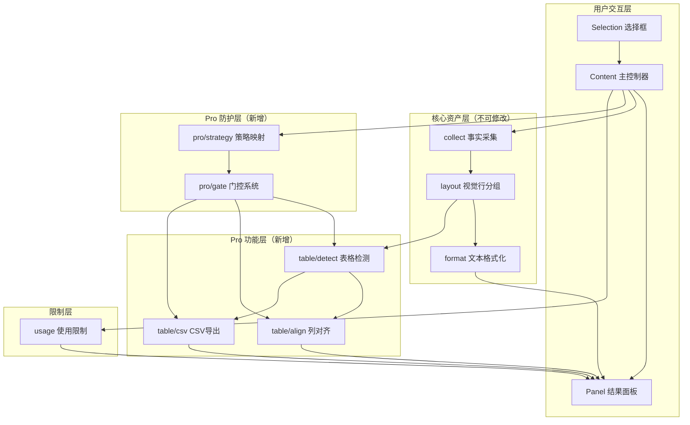
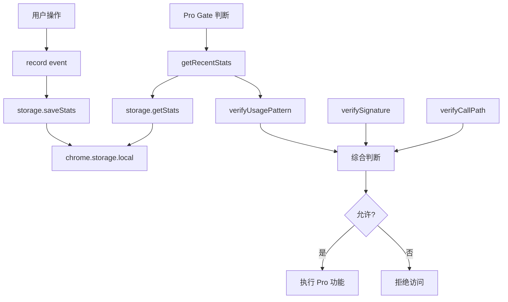

# 设计文档：表格 Pro 功能

## 概述

本设计文档描述了浏览器框选复制插件第三版的核心功能实现：**表格列识别、视觉列对齐、CSV 导出和强 Pro 限制系统**。

### 设计目标

1. **引入真正值得付费的能力**：基于视觉对齐的表格识别算法，不依赖 DOM 结构
2. **保护核心算法价值**：通过多点分散的 Pro 限制系统，防止简单绕过
3. **保持架构纯净**：核心资产（collect / layout / format）完全不修改
4. **免费版功能不变**：确保现有用户体验完全不受影响
5. **可持续扩展**：为未来更多 Pro 功能预留清晰的扩展路径

### 核心设计原则

1. **新 Pipeline 分支**：Pro 功能以独立 pipeline 形式存在，不污染 free pipeline
2. **多点分散防护**：Pro 限制分散在多个执行步骤，单点绕过无法解锁完整能力
3. **职责单一**：每个模块只负责一件事，保持高内聚低耦合
4. **算法资产保护**：collect / layout / format 作为长期资产，不被业务逻辑污染

## 架构

### 整体架构图



### Pipeline 流程对比

**Free Pipeline（免费版，保持不变）：**
```
collect → layout → format → Panel.show(text)
```

**Pro Pipeline（Pro 版，新增）：**
```
collect → layout → detectTable → alignTable → Panel.showAligned(table)
                              ↘ toCSV → Panel.enableCSVExport(csv)
```

**关键点：**
- 两条 pipeline 共享 collect 和 layout（核心资产）
- Pro pipeline 在 layout 之后分支
- 每个 Pro 步骤都有独立的 gate 检查

### 目录结构

```
content/
├── extractor/              # 核心资产（不修改）
│   ├── collect.ts         # 事实采集
│   ├── layout.ts          # 视觉行分组
│   ├── format.ts          # 文本格式化
│   └── index.ts           # 统一接口
├── table/                 # 表格功能（新增）
│   ├── detect.ts          # 表格列识别
│   ├── align.ts           # 视觉列对齐
│   └── csv.ts             # CSV 导出
├── pro/                   # Pro 防护（新增）
│   ├── gate.ts            # 门控系统
│   └── strategy.ts        # 策略映射
├── usage/                 # 使用限制（已有）
│   ├── usage.ts
│   ├── storage.ts
│   └── policy.ts
├── selection.ts           # 选择框（不修改）
├── panel.ts               # 结果面板（扩展）
└── content.ts             # 主控制器（集成）
```

## 组件和接口

### 1. Table Detection（表格检测）

**文件：** `content/table/detect.ts`

**职责：** 从视觉行结构中识别列结构，这是 Pro 功能的核心算法价值点。

**接口定义：**

```typescript
/**
 * 表格单元格
 */
export interface TableCell {
  /** 单元格文本 */
  text: string;
  /** 所属列索引 */
  col: number;
  /** 原始 X 坐标（用于调试） */
  x?: number;
}

/**
 * 表格结构
 */
export interface Table {
  /** 列数量 */
  columns: number;
  /** 行数据，每行是一个单元格数组 */
  rows: TableCell[][];
}

/**
 * 检测表格结构
 * 
 * 基于 X 轴位置聚类识别列
 * 不依赖 DOM 元素类型（table/tr/td）
 * 
 * @param lines 视觉行数组（来自 layout 输出）
 * @returns 表格结构
 */
export function detectTable(lines: TextItem[][]): Table;
```

**算法设计：**

1. **收集所有 X 坐标中心点**
   ```typescript
   const xPositions: number[] = [];
   for (const line of lines) {
     for (const item of line) {
       const centerX = item.rect.left + item.rect.width / 2;
       xPositions.push(centerX);
     }
   }
   ```

2. **X 轴聚类（K-means 或简化版本）**
   - 对 X 坐标排序
   - 使用滑动窗口合并接近的坐标
   - 阈值：`COLUMN_THRESHOLD = 20px`（可调整）
   
   ```typescript
   // 简化版聚类：合并距离小于阈值的坐标
   const clusters: number[] = [];
   const sorted = [...xPositions].sort((a, b) => a - b);
   
   let currentCluster = sorted[0];
   let clusterSum = sorted[0];
   let clusterCount = 1;
   
   for (let i = 1; i < sorted.length; i++) {
     if (sorted[i] - currentCluster <= COLUMN_THRESHOLD) {
       clusterSum += sorted[i];
       clusterCount++;
     } else {
       clusters.push(clusterSum / clusterCount); // 平均值作为列中心
       currentCluster = sorted[i];
       clusterSum = sorted[i];
       clusterCount = 1;
     }
   }
   clusters.push(clusterSum / clusterCount);
   ```

3. **分配单元格到列**
   ```typescript
   const rows: TableCell[][] = [];
   
   for (const line of lines) {
     const row: TableCell[] = [];
     for (const item of line) {
       const centerX = item.rect.left + item.rect.width / 2;
       // 找到最近的列
       let closestCol = 0;
       let minDistance = Math.abs(centerX - clusters[0]);
       
       for (let i = 1; i < clusters.length; i++) {
         const distance = Math.abs(centerX - clusters[i]);
         if (distance < minDistance) {
           minDistance = distance;
           closestCol = i;
         }
       }
       
       row.push({
         text: item.text,
         col: closestCol,
         x: centerX
       });
     }
     rows.push(row);
   }
   ```

4. **返回表格结构**
   ```typescript
   return {
     columns: clusters.length,
     rows
   };
   ```

**为什么这是 Pro 核心价值：**
- 不依赖 DOM 结构，可以识别任何视觉对齐的内容
- 算法复杂度适中，但实现细节需要调优
- 对于复杂布局（如多列文章、数据表格）有明显价值

### 2. Column Alignment（列对齐）

**文件：** `content/table/align.ts`

**职责：** 将表格数据转换为视觉对齐的文本，使用空格补齐。

**接口定义：**

```typescript
/**
 * 对齐表格
 * 
 * 计算每列最大宽度，使用空格补齐
 * 处理中文字符（按 2 个字符宽度计算）
 * 
 * @param table 表格结构
 * @returns 对齐后的二维字符串数组
 */
export function alignTable(table: Table): string[][];
```

**算法设计：**

1. **计算字符显示宽度**
   ```typescript
   /**
    * 计算字符串显示宽度
    * 中文字符按 2 个字符计算，ASCII 按 1 个字符计算
    */
   function getDisplayWidth(text: string): number {
     let width = 0;
     for (const char of text) {
       // 简化判断：Unicode > 0x7F 视为宽字符
       width += char.charCodeAt(0) > 0x7F ? 2 : 1;
     }
     return width;
   }
   ```

2. **计算每列最大宽度**
   ```typescript
   const columnWidths: number[] = new Array(table.columns).fill(0);
   
   for (const row of table.rows) {
     for (const cell of row) {
       const width = getDisplayWidth(cell.text);
       if (width > columnWidths[cell.col]) {
         columnWidths[cell.col] = width;
       }
     }
   }
   ```

3. **生成对齐文本**
   ```typescript
   const aligned: string[][] = [];
   
   for (const row of table.rows) {
     // 按列索引排序
     const sortedCells = [...row].sort((a, b) => a.col - b.col);
     
     const alignedRow: string[] = [];
     for (let col = 0; col < table.columns; col++) {
       const cell = sortedCells.find(c => c.col === col);
       const text = cell?.text || '';
       const width = getDisplayWidth(text);
       const padding = columnWidths[col] - width;
       
       // 右侧补齐空格
       alignedRow.push(text + ' '.repeat(Math.max(0, padding + 2))); // +2 为列间距
     }
     
     aligned.push(alignedRow);
   }
   
   return aligned;
   ```

**输出示例：**
```
姓名      年龄  城市
张三      25    北京
李四      30    上海
王五      28    广州
```

### 3. CSV Export（CSV 导出）

**文件：** `content/table/csv.ts`

**职责：** 将表格数据转换为符合 RFC 4180 标准的 CSV 字符串。

**接口定义：**

```typescript
/**
 * 转换为 CSV 格式
 * 
 * 遵循 RFC 4180 标准：
 * - 字段包含逗号、引号、换行符时使用引号包裹
 * - 引号转义为双引号
 * - UTF-8 编码
 * 
 * @param table 表格结构
 * @returns CSV 字符串
 */
export function toCSV(table: Table): string;
```

**算法设计：**

1. **字段转义**
   ```typescript
   /**
    * 转义 CSV 字段
    */
   function escapeCSVField(text: string): string {
     // 检查是否需要引号包裹
     const needsQuotes = /[",\n\r]/.test(text);
     
     if (needsQuotes) {
       // 引号转义为双引号
       const escaped = text.replace(/"/g, '""');
       return `"${escaped}"`;
     }
     
     return text;
   }
   ```

2. **生成 CSV**
   ```typescript
   export function toCSV(table: Table): string {
     const lines: string[] = [];
     
     for (const row of table.rows) {
       // 按列索引排序
       const sortedCells = [...row].sort((a, b) => a.col - b.col);
       
       // 填充缺失的列
       const fields: string[] = [];
       for (let col = 0; col < table.columns; col++) {
         const cell = sortedCells.find(c => c.col === col);
         fields.push(escapeCSVField(cell?.text || ''));
       }
       
       lines.push(fields.join(','));
     }
     
     return lines.join('\n');
   }
   ```

**输出示例：**
```csv
姓名,年龄,城市
张三,25,北京
李四,30,上海
王五,28,广州
```

### 4. Pro Gate（门控系统）

**文件：** `content/pro/gate.ts`

**职责：** 多点分散的 Pro 能力限制，防止简单绕过。

**接口定义：**

```typescript
/**
 * Pro 功能类型
 */
export type ProFeature =
  | 'table-detect'    // 表格检测
  | 'column-align'    // 列对齐
  | 'csv-export';     // CSV 导出

/**
 * 检查是否允许使用 Pro 功能
 * 
 * 多点判断，不是简单的 isPro 布尔值
 * 
 * @param feature Pro 功能类型
 * @returns 是否允许使用
 */
export function allow(feature: ProFeature): boolean;
```

**实现设计（多点防护）：**

```typescript
/**
 * Pro 状态（简化版本，实际应该更复杂）
 */
interface ProState {
  /** 是否为 Pro 用户 */
  isPro: boolean;
  /** 本地签名（防篡改） */
  signature: string;
  /** 功能启用状态 */
  features: Record<ProFeature, boolean>;
}

/**
 * 获取 Pro 状态
 * 
 * 实际实现应该：
 * 1. 从 storage 读取
 * 2. 验证签名
 * 3. 检查过期时间
 * 4. 验证执行路径（防直接调用）
 */
async function getProState(): Promise<ProState> {
  // 简化实现：从 storage 读取
  const result = await chrome.storage.local.get(['pro_state']);
  return result.pro_state || {
    isPro: false,
    signature: '',
    features: {
      'table-detect': false,
      'column-align': false,
      'csv-export': false
    }
  };
}

/**
 * 验证签名（简化版本）
 * 
 * 实际应该使用更复杂的算法：
 * - HMAC
 * - 时间戳
 * - 设备指纹
 */
function verifySignature(state: ProState): boolean {
  if (!state.isPro) return true; // 免费版不需要验证
  
  // 简化实现：检查签名是否存在
  // 实际应该验证签名的有效性
  return state.signature.length > 0;
}

/**
 * 检查执行路径（防直接调用）
 * 
 * 通过调用栈检查是否从合法路径调用
 */
function verifyCallPath(): boolean {
  const stack = new Error().stack || '';
  
  // 检查调用栈中是否包含 content.ts
  // 这可以防止直接在控制台调用 table 函数
  return stack.includes('content.ts') || stack.includes('content.js');
}

/**
 * 允许使用 Pro 功能
 */
export async function allow(feature: ProFeature): Promise<boolean> {
  // 1. 获取 Pro 状态
  const state = await getProState();
  
  // 2. 验证签名
  if (!verifySignature(state)) {
    console.warn('Pro signature verification failed');
    return false;
  }
  
  // 3. 验证执行路径
  if (!verifyCallPath()) {
    console.warn('Invalid call path detected');
    return false;
  }
  
  // 4. 检查功能是否启用
  if (!state.isPro) {
    return false;
  }
  
  // 5. 检查具体功能
  return state.features[feature] === true;
}
```

**为什么这是强防护：**
1. **多点判断**：签名 + 执行路径 + 功能开关，三重检查
2. **分散检查**：每个 Pro 功能单独检查，不是一次性解锁
3. **异步验证**：无法通过简单的布尔值绕过
4. **调用栈检查**：防止在控制台直接调用函数

### 5. Pro Strategy（策略映射）

**文件：** `content/pro/strategy.ts`

**职责：** 根据内容类型决定使用哪条 pipeline。

**接口定义：**

```typescript
/**
 * 内容模式
 */
export type ContentMode = 'text' | 'table';

/**
 * Pipeline 类型
 */
export type PipelineType = 'free' | 'pro';

/**
 * 解析 Pipeline 类型
 * 
 * @param mode 内容模式
 * @returns Pipeline 类型
 */
export function resolvePipeline(mode: ContentMode): PipelineType;
```

**实现：**

```typescript
export function resolvePipeline(mode: ContentMode): PipelineType {
  switch (mode) {
    case 'text':
      return 'free';
    case 'table':
      return 'pro';
    default:
      return 'free';
  }
}
```

**简单但关键：**
- 明确分离 free 和 pro 两条路径
- 为未来扩展预留空间（如 'image' 模式）
- 策略集中管理，易于调整

### 6. Content.ts 集成

**文件：** `content/content.ts`

**职责：** 主控制器，集成 Pro pipeline。

**核心流程（伪代码）：**

```typescript
class BrowserSelectionCopy {
  // ... 现有代码 ...
  
  /**
   * 处理选择完成
   */
  private async handleSelectionComplete(rect: DOMRect): Promise<void> {
    // 1. 检查使用限制（现有逻辑）
    const usageState = await checkUsage();
    if (!usageState.allowed) {
      this.panel.showLimitReached();
      return;
    }
    
    // 2. 执行 collect 和 layout（核心资产）
    const items = collect(rect);
    const lines = layout(items, DEFAULT_LAYOUT_OPTIONS);
    
    // 3. 获取用户选择的模式（默认 text）
    const mode = this.getUserSelectedMode(); // 'text' | 'table'
    
    // 4. 根据模式选择 pipeline
    const pipelineType = resolvePipeline(mode);
    
    if (pipelineType === 'pro') {
      // Pro Pipeline
      await this.handleProPipeline(lines);
    } else {
      // Free Pipeline（现有逻辑）
      const text = format(lines);
      this.panel.show(text);
    }
    
    // 5. 消耗使用次数
    await consumeUsage();
  }
  
  /**
   * 处理 Pro Pipeline
   */
  private async handleProPipeline(lines: TextItem[][]): Promise<void> {
    // 1. 检查表格检测权限
    if (!await allow('table-detect')) {
      this.panel.showProRequired();
      return;
    }
    
    // 2. 执行表格检测
    const table = detectTable(lines);
    
    // 3. 检查列对齐权限
    if (await allow('column-align')) {
      const aligned = alignTable(table);
      this.panel.showAligned(aligned);
    }
    
    // 4. 检查 CSV 导出权限
    if (await allow('csv-export')) {
      const csv = toCSV(table);
      this.panel.enableCSVExport(csv);
    }
  }
  
  /**
   * 获取用户选择的模式
   * 
   * 默认为 text，用户可以通过 UI 切换
   */
  private getUserSelectedMode(): ContentMode {
    // 简化实现：从 storage 读取
    // 实际应该有 UI 开关
    return 'text'; // 默认文本模式
  }
}
```

**关键点：**
1. **Pro 判断分散**：table-detect、column-align、csv-export 三次独立检查
2. **免费版不受影响**：默认走 free pipeline
3. **单点绕过无效**：即使绕过 table-detect，也无法使用 align 和 csv

### 7. Panel 扩展

**文件：** `content/panel.ts`

**新增方法：**

```typescript
export class Panel {
  // ... 现有代码 ...
  
  /**
   * 显示对齐后的表格
   * 
   * @param table 对齐后的二维字符串数组
   */
  showAligned(table: string[][]): void {
    // 将二维数组转换为文本
    const text = table.map(row => row.join('')).join('\n');
    
    // 使用现有的 show 方法，但添加特殊标记
    this.show(text, {
      position: { left: 50, top: 50 },
      editable: true
    });
    
    // 添加表格标识（用于样式）
    if (this.element) {
      this.element.classList.add(`${this.CSS_CLASS_PREFIX}-table-mode`);
    }
  }
  
  /**
   * 启用 CSV 导出
   * 
   * @param csv CSV 字符串
   */
  enableCSVExport(csv: string): void {
    if (!this.element) return;
    
    // 查找复制按钮容器
    const copyWrapper = this.element.querySelector(
      `.${this.CSS_CLASS_PREFIX}-panel-copy-wrapper`
    );
    
    if (!copyWrapper) return;
    
    // 创建 CSV 导出按钮
    const csvBtn = document.createElement('button');
    csvBtn.className = `${this.CSS_CLASS_PREFIX}-panel-csv-btn`;
    csvBtn.textContent = '📊 导出 CSV';
    csvBtn.onclick = () => this.downloadCSV(csv);
    
    // 插入到复制按钮之前
    copyWrapper.insertBefore(csvBtn, copyWrapper.firstChild);
  }
  
  /**
   * 下载 CSV 文件
   */
  private downloadCSV(csv: string): void {
    const blob = new Blob([csv], { type: 'text/csv;charset=utf-8;' });
    const url = URL.createObjectURL(blob);
    
    const link = document.createElement('a');
    link.href = url;
    link.download = `table-${Date.now()}.csv`;
    link.click();
    
    URL.revokeObjectURL(url);
  }
  
  /**
   * 显示 Pro 升级提示
   */
  showProRequired(): void {
    this.createElement(
      { left: 50, top: 50 },
      false,
      {
        type: 'pro-required',
        title: 'Pro 功能',
        icon: '⭐',
        message: '表格识别是 Pro 功能',
        showUpgradeButton: true
      }
    );
  }
}
```

**CSS 扩展（content.css）：**

```css
/* 表格模式样式 */
.browser-selection-copy-table-mode .browser-selection-copy-panel-textarea {
  font-family: 'Courier New', monospace;
  white-space: pre;
}

/* CSV 导出按钮 */
.browser-selection-copy-panel-csv-btn {
  padding: 8px 16px;
  margin-right: 8px;
  background: #4CAF50;
  color: white;
  border: none;
  border-radius: 4px;
  cursor: pointer;
}

.browser-selection-copy-panel-csv-btn:hover {
  background: #45a049;
}
```

## 数据模型

### TextItem（已有，来自 collect）

```typescript
interface TextItem {
  text: string;
  rect: DOMRect;
}
```

### Table（新增）

```typescript
interface TableCell {
  text: string;
  col: number;
  x?: number; // 调试用
}

interface Table {
  columns: number;
  rows: TableCell[][];
}
```

### ProState（新增）

```typescript
interface ProState {
  isPro: boolean;
  signature: string;
  features: Record<ProFeature, boolean>;
}
```

### ContentMode（新增）

```typescript
type ContentMode = 'text' | 'table';
type PipelineType = 'free' | 'pro';
```

## 数据流

### Free Pipeline（免费版）

```
用户框选
  ↓
collect(rect) → TextItem[]
  ↓
layout(items) → TextItem[][]
  ↓
format(lines) → string
  ↓
Panel.show(text)
```

### Pro Pipeline（Pro 版）

```
用户框选 + 选择表格模式
  ↓
collect(rect) → TextItem[]
  ↓
layout(items) → TextItem[][]
  ↓
resolvePipeline('table') → 'pro'
  ↓
allow('table-detect')? → 是
  ↓
detectTable(lines) → Table
  ↓
allow('column-align')? → 是
  ↓
alignTable(table) → string[][]
  ↓
Panel.showAligned(aligned)
  ↓
allow('csv-export')? → 是
  ↓
toCSV(table) → string
  ↓
Panel.enableCSVExport(csv)
```

### 权限检查流程

```
allow(feature)
  ↓
getProState() → ProState
  ↓
verifySignature(state) → boolean
  ↓
verifyCallPath() → boolean
  ↓
state.features[feature] → boolean
  ↓
返回最终结果
```


## Correctness Properties

*属性（Property）是一个特征或行为，应该在系统的所有有效执行中保持为真——本质上是关于系统应该做什么的形式化陈述。属性是人类可读规范和机器可验证正确性保证之间的桥梁。*

### Property 1: 表格列识别的正确性

*对于任何* 包含明显列对齐特征的视觉行数据（TextItem[][]），detectTable 函数应该：
1. 正确识别列的数量（基于 X 轴位置聚类）
2. 将每个文本项分配到正确的列
3. 合并 X 坐标接近的项到同一列（容差范围内）
4. 不修改输入数据（保持输入不变性）

**验证：需求 1.4, 1.5, 1.6, 1.8**

**测试策略：**
- 生成包含 2-5 列的随机表格数据
- 每列的 X 坐标在一定范围内随机偏移（模拟真实场景）
- 验证识别出的列数量正确
- 验证每个单元格被分配到正确的列
- 验证输入数据未被修改

### Property 2: 列对齐的一致性

*对于任何* 表格（Table），alignTable 函数应该生成每列宽度一致的输出，其中：
1. 同一列的所有单元格具有相同的显示宽度（通过空格补齐）
2. 中文字符按 2 个字符宽度计算
3. ASCII 字符按 1 个字符宽度计算
4. 列之间有适当的间距

**验证：需求 2.4, 2.8**

**测试策略：**
- 生成包含混合中英文的随机表格
- 验证每列的所有单元格宽度一致
- 验证中文字符宽度计算正确
- 验证列间距存在且一致

### Property 3: CSV 转义的正确性

*对于任何* 表格（Table），toCSV 函数应该正确处理所有特殊字符：
1. 字段包含引号时，引号被转义为双引号，整个字段用引号包裹
2. 字段包含逗号时，整个字段用引号包裹
3. 字段包含换行符时，整个字段用引号包裹
4. 生成的 CSV 符合 RFC 4180 标准

**验证：需求 3.3, 3.4, 3.5**

**测试策略：**
- 生成包含特殊字符的随机表格（引号、逗号、换行符）
- 验证输出的 CSV 格式正确
- 验证特殊字符被正确转义
- 验证可以被标准 CSV 解析器解析

### Property 4: 表格检测的不变性

*对于任何* 视觉行数据（TextItem[][]），在调用 detectTable 前后，输入数据应该保持完全相同（深度相等）。

**验证：需求 1.8**

**测试策略：**
- 生成随机视觉行数据
- 深度克隆输入
- 调用 detectTable
- 验证输入与克隆完全相同

### Property 5: CSV 往返一致性（Round-trip）

*对于任何* 简单表格（不包含特殊字符），将其转换为 CSV 后再解析回来，应该得到等价的表格结构。

**验证：需求 3.9**

**测试策略：**
- 生成简单的随机表格（纯文本，无特殊字符）
- 转换为 CSV
- 使用标准 CSV 解析器解析
- 验证解析结果与原表格等价

### Property 6: Pro 门控的独立性

*对于任何* Pro 功能（table-detect, column-align, csv-export），其权限检查应该是独立的，即：
1. 允许 feature A 不意味着允许 feature B
2. 拒绝 feature A 不影响 feature B 的判断
3. 每个 feature 的权限可以单独配置

**验证：需求 4.4**

**测试策略：**
- 配置不同的 Pro 状态（部分功能启用）
- 验证每个功能的权限检查独立
- 验证单个功能的启用/禁用不影响其他功能

### Property 7: 对齐后文本的可读性

*对于任何* 表格，alignTable 生成的文本应该满足：
1. 每行的长度大致相等（列对齐）
2. 列之间有明显的视觉分隔（空格）
3. 可以直接在等宽字体中正确显示

**验证：需求 2.9**

**测试策略：**
- 生成随机表格
- 验证对齐后每行长度的方差较小
- 验证列之间有足够的空格
- 验证在等宽字体中渲染时列对齐

## 错误处理

### 1. 表格检测错误

**场景：** 输入数据不包含明显的列对齐特征

**处理策略：**
```typescript
export function detectTable(lines: TextItem[][]): Table {
  // 空输入检查
  if (lines.length === 0 || lines.every(line => line.length === 0)) {
    return {
      columns: 0,
      rows: []
    };
  }
  
  // 单列情况（所有文本在同一列）
  const xPositions = collectXPositions(lines);
  if (xPositions.length === 0) {
    return {
      columns: 0,
      rows: []
    };
  }
  
  // 正常处理...
}
```

### 2. 列对齐错误

**场景：** 表格为空或列数为 0

**处理策略：**
```typescript
export function alignTable(table: Table): string[][] {
  // 空表格检查
  if (table.columns === 0 || table.rows.length === 0) {
    return [];
  }
  
  // 正常处理...
}
```

### 3. CSV 导出错误

**场景：** 表格为空

**处理策略：**
```typescript
export function toCSV(table: Table): string {
  // 空表格返回空字符串
  if (table.columns === 0 || table.rows.length === 0) {
    return '';
  }
  
  // 正常处理...
}
```

### 4. Pro 权限错误

**场景：** 用户尝试使用 Pro 功能但没有权限

**处理策略：**
```typescript
// 在 content.ts 中
if (!await allow('table-detect')) {
  // 显示 Pro 升级提示，不抛出错误
  this.panel.showProRequired();
  return;
}
```

**用户体验：**
- 不显示错误消息
- 显示友好的升级提示
- 提供明确的升级路径（占位）

### 5. 签名验证错误

**场景：** Pro 状态签名无效

**处理策略：**
```typescript
function verifySignature(state: ProState): boolean {
  try {
    // 验证签名逻辑
    if (!state.isPro) return true;
    
    // 简化实现：检查签名存在
    if (!state.signature || state.signature.length === 0) {
      console.warn('Invalid Pro signature');
      return false;
    }
    
    // 实际应该验证签名的有效性
    return true;
  } catch (error) {
    console.error('Signature verification failed:', error);
    return false;
  }
}
```

### 6. 调用路径验证错误

**场景：** 从非法路径调用 Pro 函数

**处理策略：**
```typescript
function verifyCallPath(): boolean {
  try {
    const stack = new Error().stack || '';
    
    // 检查调用栈
    const isValidPath = stack.includes('content.ts') || 
                       stack.includes('content.js');
    
    if (!isValidPath) {
      console.warn('Invalid call path detected');
    }
    
    return isValidPath;
  } catch (error) {
    console.error('Call path verification failed:', error);
    // 验证失败时默认拒绝
    return false;
  }
}
```

## 测试策略

### 单元测试

**目标：** 验证每个模块的核心功能和边界情况

**测试文件结构：**
```
test/
├── table-detect.test.ts      # 表格检测测试
├── table-align.test.ts       # 列对齐测试
├── table-csv.test.ts         # CSV 导出测试
├── pro-gate.test.ts          # Pro 门控测试
├── pro-strategy.test.ts      # 策略映射测试
└── table-integration.test.ts # 集成测试
```

**关键测试用例：**

1. **表格检测（table-detect.test.ts）**
   - 空输入处理
   - 单列表格
   - 多列表格（2-5 列）
   - 列对齐偏移容差
   - 输入不变性

2. **列对齐（table-align.test.ts）**
   - 空表格处理
   - 纯 ASCII 文本对齐
   - 中文字符对齐
   - 混合中英文对齐
   - 列宽度一致性

3. **CSV 导出（table-csv.test.ts）**
   - 空表格处理
   - 简单文本导出
   - 引号转义
   - 逗号处理
   - 换行符处理
   - 混合特殊字符

4. **Pro 门控（pro-gate.test.ts）**
   - 免费用户权限检查
   - Pro 用户权限检查
   - 功能独立性
   - 签名验证
   - 调用路径验证

5. **策略映射（pro-strategy.test.ts）**
   - text 模式映射
   - table 模式映射

### 属性测试（Property-Based Testing）

**测试库：** 使用 `fast-check` 进行属性测试

**配置：** 每个属性测试至少运行 100 次迭代

**关键属性测试：**

1. **Property 1: 表格列识别的正确性**
   ```typescript
   // test/table-detect.property.test.ts
   import fc from 'fast-check';
   
   /**
    * Feature: table-pro-features, Property 1: 表格列识别的正确性
    */
   test('detectTable correctly identifies columns', () => {
     fc.assert(
       fc.property(
         generateTableData(2, 5), // 2-5 列
         (lines) => {
           const table = detectTable(lines);
           // 验证列数量正确
           // 验证单元格分配正确
           // 验证输入未被修改
         }
       ),
       { numRuns: 100 }
     );
   });
   ```

2. **Property 2: 列对齐的一致性**
   ```typescript
   /**
    * Feature: table-pro-features, Property 2: 列对齐的一致性
    */
   test('alignTable produces consistent column widths', () => {
     fc.assert(
       fc.property(
         generateTable(),
         (table) => {
           const aligned = alignTable(table);
           // 验证每列宽度一致
           // 验证中文字符处理正确
         }
       ),
       { numRuns: 100 }
     );
   });
   ```

3. **Property 3: CSV 转义的正确性**
   ```typescript
   /**
    * Feature: table-pro-features, Property 3: CSV 转义的正确性
    */
   test('toCSV correctly escapes special characters', () => {
     fc.assert(
       fc.property(
         generateTableWithSpecialChars(),
         (table) => {
           const csv = toCSV(table);
           // 验证特殊字符被正确转义
           // 验证可以被 CSV 解析器解析
         }
       ),
       { numRuns: 100 }
     );
   });
   ```

4. **Property 5: CSV 往返一致性**
   ```typescript
   /**
    * Feature: table-pro-features, Property 5: CSV 往返一致性
    */
   test('CSV round-trip preserves table structure', () => {
     fc.assert(
       fc.property(
         generateSimpleTable(),
         (table) => {
           const csv = toCSV(table);
           const parsed = parseCSV(csv);
           // 验证解析结果与原表格等价
         }
       ),
       { numRuns: 100 }
     );
   });
   ```

### 集成测试

**目标：** 验证完整的 Pro pipeline 流程

**关键场景：**

1. **免费版用户尝试使用表格功能**
   - 验证显示 Pro 升级提示
   - 验证不执行表格检测

2. **Pro 用户使用表格功能**
   - 验证完整 pipeline 执行
   - 验证表格对齐显示
   - 验证 CSV 导出按钮显示

3. **权限绕过尝试**
   - 验证直接调用函数被拦截
   - 验证单点绕过无效

### 回归测试

**目标：** 确保免费版功能不受影响

**策略：**
- 运行所有现有测试套件
- 验证 free pipeline 行为不变
- 验证 UI 和交互不变

### 测试覆盖率目标

- **单元测试覆盖率：** ≥ 90%
- **属性测试覆盖率：** 核心算法 100%
- **集成测试覆盖率：** 关键流程 100%
- **回归测试：** 现有功能 100%

### 测试执行

**命令：**
```bash
# 运行所有测试
npm test

# 运行属性测试（包含 PBT）
npm test -- table-detect.property.test.ts

# 运行集成测试
npm test -- table-integration.test.ts

# 生成覆盖率报告
npm test -- --coverage
```

**CI/CD 集成：**
- 每次提交自动运行测试
- 测试失败阻止合并
- 覆盖率报告自动生成


## Usage 模块语义升级设计

### 概述

将 usage 模块从"限制器"升级为"行为信号记录器（Signal Source）"，使其成为 Pro gate 多点防护机制的信号输入之一，而不是直接阻断流程的单点限制器。

### 设计原则

1. **职责转变**：从"决策者"变为"信号提供者"
2. **保持兼容**：不影响现有免费版功能
3. **多点防护**：usage 是 gate 判断的输入之一，不是唯一条件
4. **无副作用**：记录行为不影响用户体验

### 架构调整

**升级前（第二版）：**
```
usage.checkUsage() → allowed/denied → 直接阻断流程
```

**升级后（第三版）：**
```
usage.record(event) → 记录行为信号
usage.getRecentStats() → 提供统计数据
  ↓
pro/gate.allow(feature) → 综合判断（usage + 签名 + 路径）
  ↓
执行或拒绝 Pro 功能
```

### Usage 模块重构

**文件：** `src/content/usage/usage.ts`

**新增接口：**

```typescript
/**
 * 使用事件类型
 */
export type UsageEvent =
  | 'select'          // 用户进行了框选
  | 'table-detect'    // 触发了表格检测
  | 'column-align'    // 触发了列对齐
  | 'csv-export';     // 触发了 CSV 导出

/**
 * 事件统计数据
 */
export interface UsageStats {
  /** 今日总选择次数 */
  selectCount: number;
  /** 今日表格检测次数 */
  tableDetectCount: number;
  /** 今日列对齐次数 */
  columnAlignCount: number;
  /** 今日 CSV 导出次数 */
  csvExportCount: number;
  /** 最后更新日期 */
  lastDate: string;
}

/**
 * 记录使用事件
 * 
 * 只记录发生过什么，不判断是否合法
 * 不阻断任何流程
 * 
 * @param event 事件类型
 */
export async function record(event: UsageEvent): Promise<void>;

/**
 * 获取最近的使用统计
 * 
 * 返回今日的事件统计数据
 * 
 * @returns 使用统计数据
 */
export async function getRecentStats(): Promise<UsageStats>;
```

**实现设计：**

```typescript
/**
 * 记录使用事件
 */
export async function record(event: UsageEvent): Promise<void> {
  // 首先检查是否需要跨天重置
  await resetIfNewDay();
  
  // 获取当前统计
  const stats = await getRecentStats();
  
  // 更新对应的计数
  switch (event) {
    case 'select':
      stats.selectCount++;
      break;
    case 'table-detect':
      stats.tableDetectCount++;
      break;
    case 'column-align':
      stats.columnAlignCount++;
      break;
    case 'csv-export':
      stats.csvExportCount++;
      break;
  }
  
  // 保存到 storage
  await saveStats(stats);
}

/**
 * 获取最近的使用统计
 */
export async function getRecentStats(): Promise<UsageStats> {
  try {
    const result = await chrome.storage.local.get(['usage_stats']);
    return result.usage_stats || {
      selectCount: 0,
      tableDetectCount: 0,
      columnAlignCount: 0,
      csvExportCount: 0,
      lastDate: new Date().toDateString()
    };
  } catch (error) {
    console.warn('Failed to get usage stats', error);
    return {
      selectCount: 0,
      tableDetectCount: 0,
      columnAlignCount: 0,
      csvExportCount: 0,
      lastDate: new Date().toDateString()
    };
  }
}
```

**兼容性处理：**

```typescript
/**
 * 检查是否允许使用（保留用于兼容）
 * 
 * @deprecated 第三版中，此函数仅用于兼容性，不再直接阻断流程
 * 实际的权限判断由 pro/gate.ts 负责
 */
export async function checkUsage(): Promise<UsageState> {
  // 保留原有逻辑，但标记为 deprecated
  await resetIfNewDay();
  const stats = await getRecentStats();
  const policy = FREE_POLICY;
  
  if (stats.selectCount >= policy.maxPerDay) {
    return {
      allowed: false,
      reason: 'limit-reached',
      remaining: 0
    };
  }
  
  return {
    allowed: true,
    remaining: policy.maxPerDay - stats.selectCount
  };
}

/**
 * 消耗一次使用额度（保留用于兼容）
 * 
 * @deprecated 第三版中，使用 record('select') 代替
 */
export async function consumeUsage(): Promise<void> {
  await record('select');
}
```

### Storage 模块扩展

**文件：** `src/content/usage/storage.ts`

**新增存储键：**

```typescript
const STORAGE_KEYS = {
  USAGE_COUNT: 'usage_count',        // 保留用于兼容
  LAST_USAGE_DATE: 'last_usage_date', // 保留用于兼容
  USAGE_STATS: 'usage_stats'          // 新增：事件统计
} as const;
```

**新增函数：**

```typescript
/**
 * 保存使用统计
 */
export async function saveStats(stats: UsageStats): Promise<void> {
  try {
    await chrome.storage.local.set({
      [STORAGE_KEYS.USAGE_STATS]: stats
    });
  } catch (error) {
    console.warn('Failed to save usage stats', error);
  }
}

/**
 * 获取使用统计
 */
export async function getStats(): Promise<UsageStats> {
  try {
    const result = await chrome.storage.local.get([STORAGE_KEYS.USAGE_STATS]);
    return result[STORAGE_KEYS.USAGE_STATS] || {
      selectCount: 0,
      tableDetectCount: 0,
      columnAlignCount: 0,
      csvExportCount: 0,
      lastDate: new Date().toDateString()
    };
  } catch (error) {
    console.warn('Failed to get usage stats', error);
    return {
      selectCount: 0,
      tableDetectCount: 0,
      columnAlignCount: 0,
      csvExportCount: 0,
      lastDate: new Date().toDateString()
    };
  }
}
```

**跨天重置扩展：**

```typescript
/**
 * 如果是新的一天，重置使用统计
 */
export async function resetIfNewDay(): Promise<void> {
  try {
    const today = new Date().toDateString();
    const stats = await getStats();
    
    // 如果日期不同，重置所有计数
    if (stats.lastDate !== today) {
      await saveStats({
        selectCount: 0,
        tableDetectCount: 0,
        columnAlignCount: 0,
        csvExportCount: 0,
        lastDate: today
      });
      
      // 同时重置旧的计数（兼容性）
      await chrome.storage.local.set({
        [STORAGE_KEYS.USAGE_COUNT]: 0,
        [STORAGE_KEYS.LAST_USAGE_DATE]: today
      });
    }
  } catch (error) {
    console.warn('Date reset failed', error);
  }
}
```

### Pro Gate 集成 Usage 信号

**文件：** `src/content/pro/gate.ts`

**修改 allow 函数：**

```typescript
import { getRecentStats } from '../usage/usage';

/**
 * 允许使用 Pro 功能
 * 
 * 多点判断：
 * 1. Pro 状态（isPro + signature）
 * 2. 执行路径验证
 * 3. Usage 行为信号（新增）
 */
export async function allow(feature: ProFeature): Promise<boolean> {
  // 1. 获取 Pro 状态
  const state = await getProState();
  
  // 2. 验证签名
  if (!verifySignature(state)) {
    console.warn('Pro signature verification failed');
    return false;
  }
  
  // 3. 验证执行路径
  if (!verifyCallPath()) {
    console.warn('Invalid call path detected');
    return false;
  }
  
  // 4. 获取 usage 行为信号（新增）
  const usageStats = await getRecentStats();
  
  // 5. 综合判断
  if (!state.isPro) {
    return false;
  }
  
  // 6. 检查具体功能
  if (!state.features[feature]) {
    return false;
  }
  
  // 7. 使用 usage 信号进行额外验证（可选）
  // 例如：检查是否有异常的使用模式
  if (!verifyUsagePattern(feature, usageStats)) {
    console.warn('Abnormal usage pattern detected');
    return false;
  }
  
  return true;
}

/**
 * 验证使用模式（新增）
 * 
 * 使用 usage 信号检测异常行为
 * 例如：短时间内大量调用 Pro 功能
 */
function verifyUsagePattern(
  feature: ProFeature,
  stats: UsageStats
): boolean {
  // 简化实现：检查是否有异常的使用频率
  // 实际可以更复杂，例如检测爆破行为
  
  switch (feature) {
    case 'table-detect':
      // 如果今日表格检测次数异常多，可能是在尝试绕过
      return stats.tableDetectCount < 1000;
    case 'column-align':
      return stats.columnAlignCount < 1000;
    case 'csv-export':
      return stats.csvExportCount < 1000;
    default:
      return true;
  }
}
```

### Content.ts 集成 Usage 记录

**文件：** `src/content/content.ts`

**在关键点记录事件：**

```typescript
import { record } from './usage/usage';

class BrowserSelectionCopy {
  /**
   * 处理选择完成
   */
  private async handleSelectionComplete(rect: DOMRect): Promise<void> {
    // 记录选择事件
    await record('select');
    
    // 检查使用限制（保留用于兼容）
    const usageState = await checkUsage();
    if (!usageState.allowed) {
      this.panel.showLimitReached();
      return;
    }
    
    // ... 执行 collect 和 layout ...
    
    const pipelineType = resolvePipeline(mode);
    
    if (pipelineType === 'pro') {
      await this.handleProPipeline(lines);
    } else {
      const text = format(lines);
      this.panel.show(text);
    }
  }
  
  /**
   * 处理 Pro Pipeline
   */
  private async handleProPipeline(lines: TextItem[][]): Promise<void> {
    // 检查表格检测权限
    if (!await allow('table-detect')) {
      this.panel.showProRequired();
      return;
    }
    
    // 记录表格检测事件
    await record('table-detect');
    
    // 执行表格检测
    const table = detectTable(lines);
    
    // 检查列对齐权限
    if (await allow('column-align')) {
      // 记录列对齐事件
      await record('column-align');
      
      const aligned = alignTable(table);
      this.panel.showAligned(aligned);
    }
    
    // 检查 CSV 导出权限
    if (await allow('csv-export')) {
      // 记录 CSV 导出事件（在实际导出时记录）
      const csv = toCSV(table);
      this.panel.enableCSVExport(csv, async () => {
        await record('csv-export');
      });
    }
  }
}
```

### 数据流图

**Usage 信号流：**



### Correctness Properties（追加）

#### Property 8: Usage 记录的幂等性

*对于任何* 使用事件（UsageEvent），多次记录同一事件应该正确累加计数，且不影响其他事件的计数。

**验证：需求 14.4, 14.5**

**测试策略：**
- 生成随机事件序列
- 记录所有事件
- 验证每种事件的计数正确
- 验证不同事件的计数独立

#### Property 9: Usage 信号不阻断流程

*对于任何* 使用事件记录操作，record 函数应该：
1. 不抛出异常（即使 storage 失败）
2. 不阻塞主流程执行
3. 不影响用户体验

**验证：需求 13.3, 14.7**

**测试策略：**
- 模拟 storage 失败
- 验证 record 函数不抛出异常
- 验证主流程继续执行

#### Property 10: Pro Gate 多点防护有效性

*对于任何* Pro 功能，即使绕过 usage 信号，也应该无法通过 Pro gate 的其他检查点（签名验证、路径验证）。

**验证：需求 15.5**

**测试策略：**
- 模拟绕过 usage 信号
- 验证签名验证仍然生效
- 验证路径验证仍然生效
- 验证无法解锁 Pro 功能

### 测试策略（追加）

#### Usage 模块测试

**文件：** `test/usage-upgrade.test.ts`

**测试用例：**

1. **事件记录测试**
   - 测试 record 函数记录各种事件
   - 测试 getRecentStats 返回正确的统计
   - 测试跨天重置

2. **兼容性测试**
   - 测试 checkUsage 仍然工作（deprecated）
   - 测试 consumeUsage 仍然工作（deprecated）
   - 测试免费版功能不受影响

3. **错误处理测试**
   - 测试 storage 失败时的降级处理
   - 测试 record 不抛出异常

#### Pro Gate 集成测试

**文件：** `test/pro-gate-usage.test.ts`

**测试用例：**

1. **Usage 信号集成测试**
   - 测试 allow 函数使用 usage 信号
   - 测试异常使用模式检测
   - 测试多点防护仍然有效

2. **绕过尝试测试**
   - 测试绕过 usage 信号无效
   - 测试单点绕过无法解锁完整能力

### 迁移指南

**从第二版到第三版的 Usage 使用变化：**

**第二版（保留用于兼容）：**
```typescript
// 检查是否允许使用
const usageState = await checkUsage();
if (!usageState.allowed) {
  panel.showLimitReached();
  return;
}

// 消耗使用次数
await consumeUsage();
```

**第三版（推荐）：**
```typescript
// 记录选择事件
await record('select');

// 检查是否允许使用（保留用于免费版限制）
const usageState = await checkUsage();
if (!usageState.allowed) {
  panel.showLimitReached();
  return;
}

// Pro 功能使用 gate 判断
if (await allow('table-detect')) {
  await record('table-detect');
  // 执行 Pro 功能
}
```

**关键变化：**
1. `checkUsage` 仍然保留，用于免费版的基础限制
2. 新增 `record` 用于记录行为事件
3. Pro 功能使用 `allow` 判断，而不是 `checkUsage`
4. Usage 从"限制器"变为"信号源"
