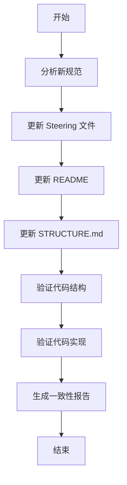

# 设计文档：更新架构规范和文档

## 概述

本设计文档描述了如何将新的插件开发规范更新到项目中，包括更新 steering 文件、README、STRUCTURE.md 文档，以及验证代码结构和实现的一致性。

设计目标：
1. 确保 steering 文件包含完整的架构规范
2. 确保文档准确反映当前的架构设计
3. 验证代码结构与规范的一致性
4. 生成架构一致性报告

## 架构

### 整体流程



### 模块划分

1. **规范分析模块**：解析新规范，提取关键信息
2. **文档更新模块**：更新 steering、README、STRUCTURE.md
3. **结构验证模块**：验证目录结构和文件命名
4. **实现验证模块**：验证代码是否符合架构原则
5. **报告生成模块**：生成架构一致性报告

## 组件和接口

### 1. 规范分析组件

**职责**：
- 解析新规范文档
- 提取架构原则、模块职责、目录结构等关键信息
- 生成结构化的规范数据

**输入**：新规范文本
**输出**：结构化的规范数据对象

### 2. Steering 文件更新组件

**职责**：
- 更新 `.kiro/steering/architecture-structure.md`
- 添加新规范中的设计原则
- 更新模块职责说明
- 添加样式和 UI 设计约定
- 添加通信与状态设计要点

**输入**：结构化的规范数据
**输出**：更新后的 steering 文件

**关键内容**：
- 整体设计原则（3 条）
- 模块与运行时职责划分（Background、Content、Popup、Options）
- 样式与 UI 设计约定（3 条）
- 目录结构设计共识
- 通信与状态设计要点（3 条）
- 工程与构建层共识
- 被明确否定的设计方向

### 3. README 更新组件

**职责**：
- 更新项目结构说明
- 更新核心架构说明
- 更新核心组件说明
- 确保与新规范一致

**输入**：结构化的规范数据、当前 README 内容
**输出**：更新后的 README

**更新要点**：
- 项目结构：确保目录树与新规范一致
- 核心架构：更新架构原则说明
- 核心组件：更新各层文件职责说明
- 开发规范：添加新规范中的约束

### 4. STRUCTURE.md 更新组件

**职责**：
- 更新源码目录结构说明
- 更新模块化设计原则
- 更新文件职责说明
- 添加新规范中的约束

**输入**：结构化的规范数据、当前 STRUCTURE.md 内容
**输出**：更新后的 STRUCTURE.md

**更新要点**：
- 源码目录：详细的目录结构和文件说明
- 模块化设计原则：与新规范保持一致
- 文件职责：每个文件的详细职责说明
- 设计理念：添加新规范中的设计共识

### 5. 结构验证组件

**职责**：
- 验证 `src/` 目录结构
- 验证文件命名规范
- 验证模块依赖关系
- 记录差异和建议

**输入**：实际代码结构、规范定义的结构
**输出**：结构验证报告

**验证项**：
- 目录结构是否完整（background、content、popup、shared、images）
- 文件命名是否符合规范
- 是否存在不应该存在的文件或目录
- shared/constants.ts 是否应该存在（新规范中提到）

### 6. 实现验证组件

**职责**：
- 验证 Background 层实现
- 验证 Content 层实现
- 验证 Shared 层实现
- 验证消息通信实现
- 记录违规项和建议

**输入**：实际代码、规范定义的约束
**输出**：实现验证报告

**验证项**：
- Background 层是否只包含业务逻辑和状态管理
- Content 层是否不包含业务逻辑判断
- Content 层是否不直接访问 storage
- Shared 层是否只包含类型定义
- 消息协议是否符合规范

### 7. 报告生成组件

**职责**：
- 汇总所有验证结果
- 生成架构一致性报告
- 提供调整建议和实施步骤

**输入**：所有验证报告
**输出**：完整的架构一致性报告（Markdown 格式）

**报告结构**：
1. 执行摘要
2. 文档更新摘要
3. 结构验证结果
4. 实现验证结果
5. 差异分析
6. 调整建议
7. 实施步骤

## 数据模型

### ArchitectureSpec（架构规范）

```typescript
interface ArchitectureSpec {
  // 整体设计原则
  designPrinciples: string[];
  
  // 模块职责
  modules: {
    background: ModuleSpec;
    content: ModuleSpec;
    popup: ModuleSpec;
    shared: ModuleSpec;
  };
  
  // 目录结构
  directoryStructure: DirectoryNode;
  
  // 样式和 UI 约定
  styleConventions: string[];
  
  // 通信协议
  communicationProtocol: {
    contentToBackground: MessageSpec;
    backgroundToContent: MessageSpec;
  };
  
  // 约束条件
  constraints: string[];
  
  // 被否定的设计方向
  rejectedDesigns: string[];
}

interface ModuleSpec {
  name: string;
  responsibilities: string[];
  prohibitions: string[];
  files: FileSpec[];
}

interface FileSpec {
  name: string;
  purpose: string;
  responsibilities: string[];
}

interface DirectoryNode {
  name: string;
  type: 'file' | 'directory';
  children?: DirectoryNode[];
  description?: string;
}

interface MessageSpec {
  format: string;
  fields: Record<string, string>;
}
```

### ValidationResult（验证结果）

```typescript
interface ValidationResult {
  category: 'structure' | 'implementation';
  passed: boolean;
  issues: ValidationIssue[];
  suggestions: string[];
}

interface ValidationIssue {
  severity: 'error' | 'warning' | 'info';
  location: string;
  description: string;
  expected: string;
  actual: string;
}
```

### ArchitectureReport（架构报告）

```typescript
interface ArchitectureReport {
  timestamp: string;
  summary: {
    totalIssues: number;
    errors: number;
    warnings: number;
    infos: number;
  };
  documentUpdates: {
    steering: boolean;
    readme: boolean;
    structure: boolean;
  };
  structureValidation: ValidationResult;
  implementationValidation: ValidationResult;
  recommendations: string[];
}
```

## 正确性属性

*属性是关于系统应该满足的特征或行为的形式化陈述，它们在所有有效执行中都应该成立。属性是人类可读规范和机器可验证正确性保证之间的桥梁。*

### 属性 1：Steering 文件完整性

*对于任何*新规范中定义的内容（架构原则、模块职责、目录结构、样式约定、通信设计要点），更新后的 steering 文件都应该包含相应的完整说明。

**验证：需求 1.1, 1.2, 1.3, 1.4, 1.5**

### 属性 2：README 文档一致性

*对于任何*新规范中定义的架构信息（项目结构、核心架构、核心组件、设计原则），更新后的 README 都应该与规范保持一致。

**验证：需求 2.1, 2.2, 2.3, 2.5**

### 属性 3：STRUCTURE.md 文档一致性

*对于任何*新规范中定义的结构信息（源码目录、模块化设计原则、文件职责、约束），更新后的 STRUCTURE.md 都应该与规范保持一致。

**验证：需求 3.1, 3.2, 3.3, 3.5**

### 属性 4：结构验证正确性

*对于任何*给定的代码结构和规范定义，验证器都应该正确识别结构是否一致（目录结构、文件命名、模块依赖）。

**验证：需求 4.1, 4.3, 4.5**

### 属性 5：差异报告完整性

*对于任何*验证过程中发现的不一致或违规项，验证器都应该记录详细的差异信息并提供具体的调整建议。

**验证：需求 4.2, 4.4, 5.4**

### 属性 6：架构一致性报告完整性

*对于任何*完成的验证过程，生成的报告都应该包含完整的验证结果、差异分析、调整建议和实施步骤，并按优先级排序。

**验证：需求 6.1, 6.2, 6.3, 6.5**

## 错误处理

### 文件读取错误

- **场景**：无法读取现有文档或代码文件
- **处理**：记录错误，跳过该文件的验证，在报告中标注
- **恢复**：提示用户检查文件权限和路径

### 文件写入错误

- **场景**：无法写入更新后的文档或报告
- **处理**：记录错误，保留原文件，提示用户
- **恢复**：检查文件权限，尝试备份后重试

### 规范解析错误

- **场景**：新规范格式不符合预期
- **处理**：记录错误，使用默认值或跳过该部分
- **恢复**：提示用户检查规范格式

### 代码分析错误

- **场景**：无法解析代码文件（语法错误等）
- **处理**：记录错误，跳过该文件的详细分析
- **恢复**：在报告中标注，建议用户修复语法错误

## 测试策略

### 单元测试

**文档更新测试**：
- 测试 steering 文件更新逻辑
- 测试 README 更新逻辑
- 测试 STRUCTURE.md 更新逻辑
- 验证更新后的内容包含必要的信息

**结构验证测试**：
- 测试目录结构验证逻辑
- 测试文件命名验证逻辑
- 测试依赖关系验证逻辑
- 使用模拟的文件系统结构

**实现验证测试**：
- 测试 Background 层验证逻辑
- 测试 Content 层验证逻辑
- 测试 Shared 层验证逻辑
- 使用模拟的代码片段

**报告生成测试**：
- 测试报告格式正确性
- 测试报告内容完整性
- 验证建议的合理性

### 属性测试

本项目的核心功能是文档更新和验证，以下属性测试确保系统的正确性：

**属性测试 1：Steering 文件完整性**
- *对于任何*新规范中定义的内容，更新后的 steering 文件都应该包含相应的完整说明
- 测试方法：生成随机的规范内容，执行更新，验证 steering 文件包含所有必要信息
- 最少 100 次迭代
- **Feature: update-architecture-spec, Property 1: Steering 文件完整性**

**属性测试 2：README 文档一致性**
- *对于任何*新规范中定义的架构信息，更新后的 README 都应该与规范保持一致
- 测试方法：生成随机的架构信息，执行更新，验证 README 与规范一致
- 最少 100 次迭代
- **Feature: update-architecture-spec, Property 2: README 文档一致性**

**属性测试 3：STRUCTURE.md 文档一致性**
- *对于任何*新规范中定义的结构信息，更新后的 STRUCTURE.md 都应该与规范保持一致
- 测试方法：生成随机的结构信息，执行更新，验证 STRUCTURE.md 与规范一致
- 最少 100 次迭代
- **Feature: update-architecture-spec, Property 3: STRUCTURE.md 文档一致性**

**属性测试 4：结构验证正确性**
- *对于任何*给定的代码结构和规范定义，验证器都应该正确识别结构是否一致
- 测试方法：生成随机的代码结构和规范，验证验证器的判断正确性
- 最少 100 次迭代
- **Feature: update-architecture-spec, Property 4: 结构验证正确性**

**属性测试 5：差异报告完整性**
- *对于任何*验证过程中发现的不一致或违规项，验证器都应该记录详细的差异信息并提供具体的调整建议
- 测试方法：生成随机的不一致情况，验证验证器的报告完整性
- 最少 100 次迭代
- **Feature: update-architecture-spec, Property 5: 差异报告完整性**

**属性测试 6：架构一致性报告完整性**
- *对于任何*完成的验证过程，生成的报告都应该包含完整的验证结果、差异分析、调整建议和实施步骤
- 测试方法：生成随机的验证结果，验证报告的完整性和正确性
- 最少 100 次迭代
- **Feature: update-architecture-spec, Property 6: 架构一致性报告完整性**

**属性测试 7：文档更新幂等性**
- *对于任何*已经符合规范的文档，再次执行更新操作不应该改变文档内容
- 测试方法：对已更新的文档再次执行更新，验证内容不变
- 最少 100 次迭代
- **Feature: update-architecture-spec, Property 7: 文档更新幂等性**

**属性测试 8：验证结果一致性**
- *对于任何*给定的代码结构，多次执行验证应该得到相同的结果
- 测试方法：对同一代码结构多次执行验证，验证结果一致
- 最少 100 次迭代
- **Feature: update-architecture-spec, Property 8: 验证结果一致性**

### 集成测试

**端到端测试**：
- 测试完整的更新流程（从规范分析到报告生成）
- 使用实际的项目文件
- 验证所有文档都被正确更新
- 验证报告包含所有必要信息

**回归测试**：
- 确保更新后的文档仍然可读且格式正确
- 确保更新不会破坏现有的文档结构
- 确保验证逻辑不会产生误报

### 手动测试

**文档审查**：
- 人工审查更新后的 steering 文件
- 人工审查更新后的 README
- 人工审查更新后的 STRUCTURE.md
- 确保内容准确、完整、易读

**报告审查**：
- 人工审查生成的架构一致性报告
- 验证差异分析的准确性
- 验证调整建议的合理性

## 实施注意事项

### 文档更新原则

1. **保留有价值的内容**：不要删除现有文档中有价值的信息，只更新过时或不一致的部分
2. **保持格式一致**：确保更新后的文档格式与原文档保持一致
3. **添加必要的说明**：对于新增的内容，添加必要的上下文说明
4. **使用中文**：所有文档和注释使用中文

### 验证原则

1. **非侵入式**：验证过程不应该修改代码
2. **全面性**：覆盖所有关键的架构约束
3. **准确性**：避免误报和漏报
4. **可操作性**：提供具体的修复建议

### 报告原则

1. **清晰性**：使用清晰的语言描述问题
2. **优先级**：按严重程度排序问题
3. **可操作性**：提供具体的实施步骤
4. **完整性**：包含所有必要的信息

## 实施步骤

1. **分析新规范**：提取关键信息，生成结构化数据
2. **更新 steering 文件**：添加新规范中的所有内容
3. **更新 README**：确保与新规范一致
4. **更新 STRUCTURE.md**：详细描述架构设计
5. **验证代码结构**：检查目录结构和文件命名
6. **验证代码实现**：检查是否符合架构原则
7. **生成报告**：汇总所有结果，提供建议
8. **人工审查**：审查所有更新和报告
