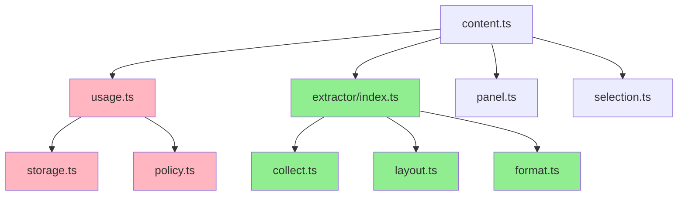
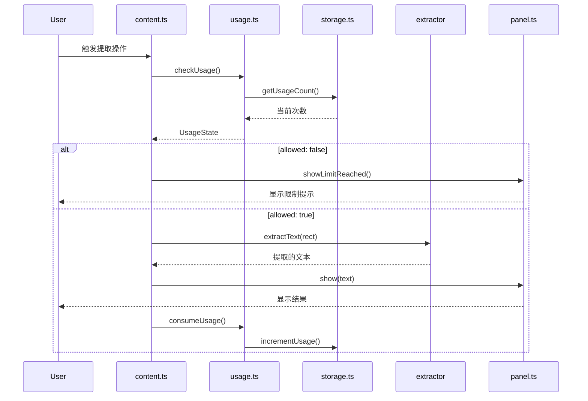
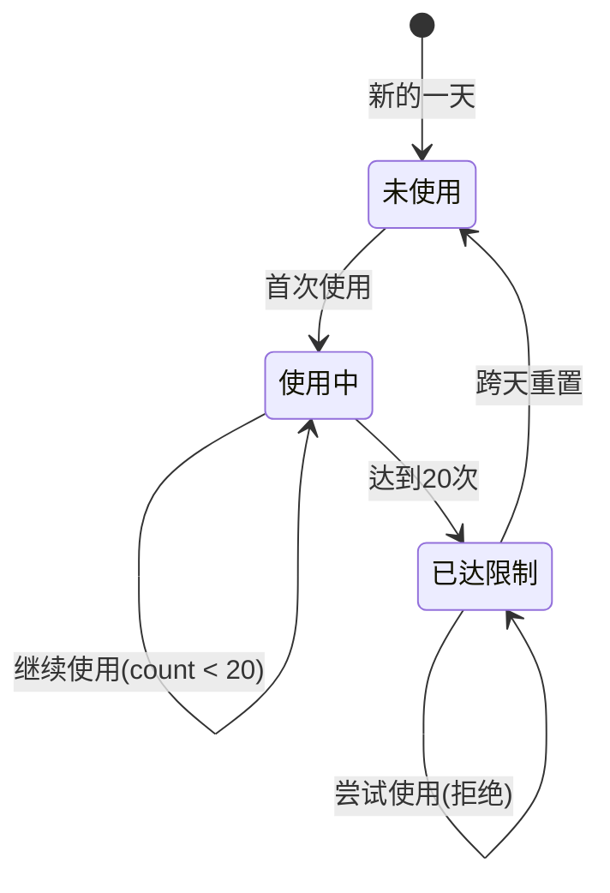

# 设计文档：使用限制系统

## 概述

使用限制系统是一个非破坏性的商业逻辑层，在保持核心算法（collect → layout → format）完全独立的前提下，为浏览器框选复制插件引入免费使用限制和Pro解锁的基础架构。

### 设计目标

1. **非侵入性**：限制逻辑只存在于流程层，不进入算法层
2. **纯函数保护**：核心算法模块保持纯函数特性，不受商业逻辑污染
3. **单向依赖**：清晰的依赖方向，避免循环依赖
4. **集中控制**：限制点集中在单一入口，难以绕过
5. **平滑演进**：为未来Pro功能预留接口，但当前不实现

### 核心原则

- 免费版逻辑 ≠ 算法降级（只限频次/输出，不降低质量）
- 限制检查在 extractText 调用前，消耗在成功后
- 不引入网络请求，不依赖服务器
- 不新增浏览器权限

## 架构

### 模块结构

```
content/
├── usage/
│   ├── usage.ts      # 统一使用控制入口
│   ├── policy.ts     # 策略定义层
│   └── storage.ts    # 状态持久化
├── extractor/        # 核心算法（不可侵入）
│   ├── collect.ts
│   ├── layout.ts
│   ├── format.ts
│   └── index.ts
├── content.ts        # 主流程控制器（集成点）
├── panel.ts          # UI展示层（扩展）
└── selection.ts      # 选择框（不变）
```

### 依赖关系图



**说明**：
- 绿色：核心算法层（禁止侵入）
- 粉色：使用限制层（新增）
- 白色：现有模块（最小修改）

### 数据流



## 组件和接口

### 1. Usage 模块（usage.ts）

#### 职责
- 统一的使用限制判断入口
- 消耗使用额度
- 不直接访问UI，不弹窗

#### 接口定义

```typescript
/**
 * 使用状态
 */
export interface UsageState {
  allowed: boolean;           // 是否允许使用
  reason?: 'limit-reached';   // 拒绝原因
  remaining?: number;         // 剩余次数
}

/**
 * 检查是否允许使用
 * 只判断，不修改状态
 */
export function checkUsage(): Promise<UsageState>;

/**
 * 消耗一次使用额度
 * 只在成功提取后调用
 */
export function consumeUsage(): Promise<void>;
```

#### 实现逻辑

```typescript
// 伪代码
async function checkUsage(): Promise<UsageState> {
  await resetIfNewDay();
  const count = await getUsageCount();
  const policy = FREE_POLICY;
  
  if (count >= policy.maxPerDay) {
    return {
      allowed: false,
      reason: 'limit-reached',
      remaining: 0
    };
  }
  
  return {
    allowed: true,
    remaining: policy.maxPerDay - count
  };
}

async function consumeUsage(): Promise<void> {
  await incrementUsage();
}
```

### 2. Policy 模块（policy.ts）

#### 职责
- 定义免费版和Pro版的使用策略
- 纯数据定义，无业务逻辑

#### 接口定义

```typescript
/**
 * 使用策略
 */
export interface UsagePolicy {
  maxPerDay: number;  // 每日最大使用次数
}

/**
 * 免费策略：每日20次
 */
export const FREE_POLICY: UsagePolicy = {
  maxPerDay: 20
};

/**
 * Pro策略（预留，当前不实现）
 * 
 * export const PRO_POLICY: UsagePolicy = {
 *   maxPerDay: Infinity
 * };
 */
```

### 3. Storage 模块（storage.ts）

#### 职责
- 使用次数的持久化
- 自动跨天重置
- 不暴露给其他模块直接使用

#### 接口定义

```typescript
/**
 * 存储键名
 */
const STORAGE_KEYS = {
  USAGE_COUNT: 'usage_count',
  LAST_USAGE_DATE: 'last_usage_date'
} as const;

/**
 * 获取当日使用次数
 */
export async function getUsageCount(): Promise<number>;

/**
 * 增加使用次数
 */
export async function incrementUsage(): Promise<void>;

/**
 * 如果是新的一天，重置使用次数
 */
export async function resetIfNewDay(): Promise<void>;
```

#### 实现逻辑

```typescript
// 伪代码
async function resetIfNewDay(): Promise<void> {
  const today = new Date().toDateString();
  const result = await chrome.storage.local.get([
    STORAGE_KEYS.LAST_USAGE_DATE
  ]);
  
  const lastDate = result[STORAGE_KEYS.LAST_USAGE_DATE];
  
  if (lastDate !== today) {
    await chrome.storage.local.set({
      [STORAGE_KEYS.USAGE_COUNT]: 0,
      [STORAGE_KEYS.LAST_USAGE_DATE]: today
    });
  }
}

async function getUsageCount(): Promise<number> {
  const result = await chrome.storage.local.get([
    STORAGE_KEYS.USAGE_COUNT
  ]);
  return result[STORAGE_KEYS.USAGE_COUNT] || 0;
}

async function incrementUsage(): Promise<void> {
  const count = await getUsageCount();
  await chrome.storage.local.set({
    [STORAGE_KEYS.USAGE_COUNT]: count + 1
  });
}
```

### 4. Content 控制器集成（content.ts）

#### 修改点

在 `handleMouseUp` 方法中，在调用 `extractText` 之前插入使用检查：

```typescript
// 修改前
private handleMouseUp(event: MouseEvent): void {
  // ... 现有代码 ...
  
  if (rect && this.selection.isValid(rect)) {
    const text = extractText(rect, BrowserSelectionCopy.DEFAULT_LAYOUT_OPTIONS);
    
    if (text.trim()) {
      this.lastSelectionRect = rect;
      this.handleShowResult(text);
    } else {
      this.panel.hide();
      this.lastSelectionRect = null;
    }
  }
  
  // ... 现有代码 ...
}

// 修改后
private async handleMouseUp(event: MouseEvent): Promise<void> {
  // ... 现有代码 ...
  
  if (rect && this.selection.isValid(rect)) {
    // 检查使用限制
    const usage = await checkUsage();
    if (!usage.allowed) {
      this.panel.showLimitReached();
      return;
    }
    
    // 执行提取
    const text = extractText(rect, BrowserSelectionCopy.DEFAULT_LAYOUT_OPTIONS);
    
    if (text.trim()) {
      this.lastSelectionRect = rect;
      this.handleShowResult(text);
      // 消耗使用次数
      await consumeUsage();
    } else {
      this.panel.hide();
      this.lastSelectionRect = null;
    }
  }
  
  // ... 现有代码 ...
}
```

#### 关键点
- 在 extractText 调用前检查
- 在成功展示结果后消耗
- 不修改 extractText 接口
- 不在 extractor 和 usage 之间建立依赖

### 5. Panel 扩展（panel.ts）

#### 新增方法

```typescript
/**
 * 显示使用限制提示
 */
showLimitReached(): void {
  this.createElement(
    { left: 50, top: 50 },
    false,
    {
      title: '使用限制',
      message: '今日免费次数已用完',
      showUpgradeButton: true
    }
  );
}
```

#### UI设计

```
┌─────────────────────────────────┐
│ 🚫 使用限制                  × │
├─────────────────────────────────┤
│                                 │
│   今日免费次数已用完            │
│   (20/20)                       │
│                                 │
│   明天将自动重置                │
│                                 │
├─────────────────────────────────┤
│  [ 升级 Pro（占位）]            │
└─────────────────────────────────┘
```

#### 实现要点
- 复用现有的 createElement 逻辑
- 不实现支付逻辑
- 不实现Pro校验逻辑
- 升级按钮当前无实际功能（占位）

## 数据模型

### 存储结构

```typescript
// chrome.storage.local 中的数据结构
interface StorageData {
  usage_count: number;        // 当日使用次数
  last_usage_date: string;    // 最后使用日期（toDateString格式）
}
```

### 状态转换




## 正确性属性

*属性是一个特征或行为，应该在系统的所有有效执行中保持为真——本质上是关于系统应该做什么的形式化陈述。属性作为人类可读规范和机器可验证正确性保证之间的桥梁。*

### 属性 1：checkUsage 幂等性

*对于任意*系统状态，在不调用 consumeUsage 的情况下，多次调用 checkUsage 应该返回相同的 UsageState

**验证需求：1.5**

### 属性 2：存储数据完整性

*对于任意*使用次数和日期，调用 incrementUsage 后，存储中应该包含正确的 usage_count 和 last_usage_date 字段

**验证需求：3.6**

### 属性 3：跨天重置

*对于任意*日期变化（从日期A到日期B，其中A ≠ B），调用 resetIfNewDay 后，使用次数应该被重置为 0

**验证需求：3.7, 8.5**

### 属性 4：使用次数限制

*对于任意*使用次数 n，当 n < 20 时，checkUsage 应该返回 allowed: true；当 n >= 20 时，checkUsage 应该返回 allowed: false

**验证需求：8.2, 8.3**

### 属性 5：使用次数递增

*对于任意*初始使用次数 n，调用 consumeUsage 后，使用次数应该变为 n + 1

**验证需求：12.5**

### 属性 6：跨天重置不依赖缓存清除

*对于任意*日期变化，即使清除 chrome.storage.local 中的所有数据，基于当前日期的重置逻辑仍然应该正确工作（首次使用时初始化为0）

**验证需求：12.7**

### 属性 7：未达限制时行为一致性

*对于任意*使用次数 n < 20，系统的提取行为（UI、交互、结果）应该与没有使用限制系统时完全一致

**验证需求：11.1-11.7**

## 错误处理

### 1. Storage 访问失败

**场景**：chrome.storage.local 不可用或访问失败

**处理策略**：
- 降级为内存存储（仅当前会话有效）
- 记录警告日志
- 不阻塞用户使用

```typescript
// 伪代码
async function getUsageCount(): Promise<number> {
  try {
    const result = await chrome.storage.local.get([STORAGE_KEYS.USAGE_COUNT]);
    return result[STORAGE_KEYS.USAGE_COUNT] || 0;
  } catch (error) {
    console.warn('Storage access failed, using memory fallback', error);
    return memoryFallback.usageCount || 0;
  }
}
```

### 2. 日期解析异常

**场景**：存储的日期格式异常或无法解析

**处理策略**：
- 视为新的一天，重置计数
- 更新为当前日期

```typescript
// 伪代码
async function resetIfNewDay(): Promise<void> {
  try {
    const today = new Date().toDateString();
    const result = await chrome.storage.local.get([STORAGE_KEYS.LAST_USAGE_DATE]);
    const lastDate = result[STORAGE_KEYS.LAST_USAGE_DATE];
    
    if (!lastDate || lastDate !== today) {
      await chrome.storage.local.set({
        [STORAGE_KEYS.USAGE_COUNT]: 0,
        [STORAGE_KEYS.LAST_USAGE_DATE]: today
      });
    }
  } catch (error) {
    console.warn('Date reset failed', error);
  }
}
```

### 3. 并发调用

**场景**：用户快速连续触发多次提取操作

**处理策略**：
- checkUsage 和 consumeUsage 都是异步操作
- 使用 chrome.storage.local 的原子性保证
- 不需要额外的锁机制

### 4. 数据迁移

**场景**：从没有使用限制的版本升级到有使用限制的版本

**处理策略**：
- 首次运行时，如果没有存储数据，初始化为 0
- 不影响现有用户的其他设置

## 测试策略

### 单元测试

**目标**：验证各个模块的独立功能

**测试范围**：
1. **Storage 模块**
   - 测试 getUsageCount 返回正确的计数
   - 测试 incrementUsage 正确增加计数
   - 测试 resetIfNewDay 在日期变化时重置计数
   - 测试 resetIfNewDay 在同一天不重置计数

2. **Usage 模块**
   - 测试 checkUsage 在未达限制时返回 allowed: true
   - 测试 checkUsage 在达到限制时返回 allowed: false
   - 测试 checkUsage 不修改状态（幂等性）
   - 测试 consumeUsage 正确增加计数

3. **Policy 模块**
   - 测试 FREE_POLICY.maxPerDay 等于 20

4. **Panel 模块**
   - 测试 showLimitReached 方法存在
   - 测试 showLimitReached 显示正确的提示文本
   - 测试 show 方法保持不变

**测试工具**：Jest

**Mock策略**：
- Mock chrome.storage.local API
- 不Mock业务逻辑模块

### 属性测试

**目标**：验证系统在各种输入下的通用属性

**测试范围**：

1. **属性 1：checkUsage 幂等性**
   ```typescript
   // 对于任意使用次数 n (0 <= n <= 30)
   // 多次调用 checkUsage 应该返回相同结果
   test('checkUsage is idempotent', async () => {
     for (let n = 0; n <= 30; n++) {
       // 设置使用次数为 n
       const result1 = await checkUsage();
       const result2 = await checkUsage();
       const result3 = await checkUsage();
       
       expect(result1).toEqual(result2);
       expect(result2).toEqual(result3);
     }
   });
   ```
   **验证需求：1.5**

2. **属性 3：跨天重置**
   ```typescript
   // 对于任意日期变化
   // 调用 resetIfNewDay 后，使用次数应该为 0
   test('usage resets on new day', async () => {
     // 生成随机日期对 (dateA, dateB)，其中 dateA ≠ dateB
     // 设置 last_usage_date 为 dateA
     // 设置 usage_count 为随机值
     // 模拟当前日期为 dateB
     // 调用 resetIfNewDay
     // 验证 usage_count 为 0
   });
   ```
   **验证需求：3.7, 8.5**

3. **属性 4：使用次数限制**
   ```typescript
   // 对于任意使用次数 n (0 <= n <= 30)
   // 当 n < 20 时，allowed 应该为 true
   // 当 n >= 20 时，allowed 应该为 false
   test('usage limit enforced correctly', async () => {
     for (let n = 0; n <= 30; n++) {
       // 设置使用次数为 n
       const result = await checkUsage();
       
       if (n < 20) {
         expect(result.allowed).toBe(true);
       } else {
         expect(result.allowed).toBe(false);
       }
     }
   });
   ```
   **验证需求：8.2, 8.3**

4. **属性 5：使用次数递增**
   ```typescript
   // 对于任意初始使用次数 n (0 <= n < 20)
   // 调用 consumeUsage 后，使用次数应该为 n + 1
   test('consumeUsage increments count', async () => {
     for (let n = 0; n < 20; n++) {
       // 设置使用次数为 n
       const before = await getUsageCount();
       await consumeUsage();
       const after = await getUsageCount();
       
       expect(after).toBe(before + 1);
     }
   });
   ```
   **验证需求：12.5**

**测试工具**：Jest（使用循环模拟属性测试）

**配置**：
- 每个属性测试至少运行 100 次迭代
- 使用随机生成的测试数据

### 集成测试

**目标**：验证模块间的协作

**测试范围**：
1. 测试 content.ts 在 extractText 前调用 checkUsage
2. 测试 content.ts 在 allowed: false 时调用 panel.showLimitReached
3. 测试 content.ts 在成功提取后调用 consumeUsage
4. 测试完整的使用流程：从 0 次到 20 次再到限制

**测试工具**：Jest

### 回归测试

**目标**：确保新功能不影响现有功能

**测试范围**：
1. 运行所有现有测试，确保通过
2. 验证 extractor 模块完全不受影响
3. 验证 selection 模块完全不受影响
4. 验证 panel 的现有功能（show、hide、copy）正常工作

**验证需求：10.2, 11.1-11.7**

### 测试覆盖率目标

- 单元测试覆盖率：> 90%
- 属性测试覆盖核心业务逻辑
- 集成测试覆盖关键流程
- 回归测试确保零破坏

## 实现注意事项

### 1. 不可侵入区域

**严格禁止修改**：
- `src/content/extractor/collect.ts`
- `src/content/extractor/layout.ts`
- `src/content/extractor/format.ts`
- `src/content/extractor/index.ts`

**原因**：这些是核心算法资产，必须保持纯函数特性

### 2. 最小修改区域

**需要修改但保持最小**：
- `src/content/content.ts`：只在 handleMouseUp 中添加使用检查
- `src/content/panel.ts`：只添加 showLimitReached 方法

### 3. 新增区域

**完全新增的模块**：
- `src/content/usage/usage.ts`
- `src/content/usage/policy.ts`
- `src/content/usage/storage.ts`

### 4. 依赖注入

不使用依赖注入框架，保持简单：
- usage.ts 直接导入 storage.ts 和 policy.ts
- content.ts 直接导入 usage.ts

### 5. 类型安全

所有新增代码必须：
- 使用 TypeScript 严格模式
- 导出明确的接口定义
- 不使用 any 类型

### 6. 向后兼容

确保：
- 不修改现有的公共接口
- 不改变现有的行为（未达限制时）
- 不破坏现有的测试

## 部署和发布

### 版本号

建议版本号：`2.0.0`（引入重大新功能）

### 发布说明

```markdown
## v2.0.0 - 使用限制系统

### 新增功能
- 免费版每日使用限制（20次/天）
- 次日自动重置使用次数
- 达到限制时的友好提示

### 技术改进
- 新增使用限制模块（非侵入式设计）
- 核心算法保持独立和纯净
- 为未来Pro版本预留接口

### 向后兼容
- 未达限制时，功能和体验与 v1.x 完全一致
- 不影响现有用户的使用习惯
```

### 迁移指南

**对于现有用户**：
- 首次升级后，自动初始化使用计数为 0
- 不影响现有的插件设置（enabled、panelPosition）
- 不需要任何手动操作

**对于开发者**：
- 核心算法模块（extractor）完全不受影响
- 新增的 usage 模块可以独立测试和维护
- 构建流程保持不变

## 未来演进

### Pro 版本接入点

当需要实现 Pro 版本时，只需要：

1. **在 policy.ts 中添加 PRO_POLICY**
   ```typescript
   export const PRO_POLICY: UsagePolicy = {
     maxPerDay: Infinity
   };
   ```

2. **在 usage.ts 中添加策略选择逻辑**
   ```typescript
   async function getCurrentPolicy(): Promise<UsagePolicy> {
     const isPro = await checkProStatus();
     return isPro ? PRO_POLICY : FREE_POLICY;
   }
   ```

3. **实现 Pro 状态检查**
   ```typescript
   async function checkProStatus(): Promise<boolean> {
     // 从 storage 或远程服务器检查 Pro 状态
   }
   ```

4. **在 panel.ts 中实现升级按钮功能**
   ```typescript
   // 当前是占位按钮，未来可以跳转到支付页面
   ```

### 可能的扩展

1. **使用统计**：记录用户的使用模式，用于产品优化
2. **A/B 测试**：不同的免费次数限制
3. **试用期**：新用户前7天不限次数
4. **推荐奖励**：推荐新用户获得额外次数

## 总结

使用限制系统通过以下设计实现了非破坏性接入：

1. **架构隔离**：限制逻辑只在流程层，不进入算法层
2. **单向依赖**：清晰的依赖方向，避免循环依赖
3. **集中控制**：单一入口点，难以绕过
4. **平滑演进**：为Pro版本预留接口，但当前不实现
5. **向后兼容**：未达限制时，行为与第一版完全一致

这个设计确保了核心算法的纯净性，同时为商业化提供了坚实的基础。
