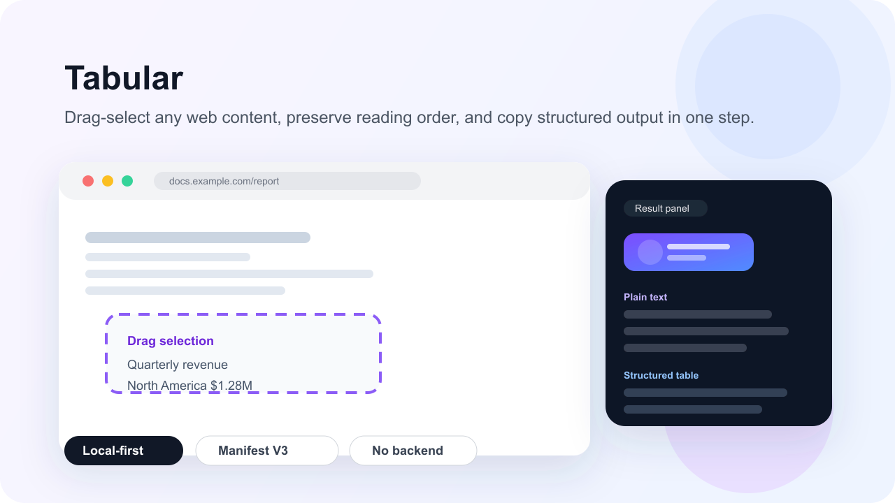

# Tabular

[中文](./README.md) | [English](./README.en.md)

> Drag-select any area of a web page, preserve visual reading order, and copy clean text or structured table-like data in one step.

Tabular is a Chrome extension for fast web content capture. It lets users draw a rectangle over any page, extract visible content locally, and format the result for reuse without sending data to a backend.

## English Summary

- Drag-select content from arbitrary web pages.
- Preserve reading order for copied plain text.
- Convert table-like regions into structured output.
- Keep processing local to the browser with no external service dependency.
- Ship as a Manifest V3 extension built with TypeScript.

## Roadmap

- [x] Drag selection with editable result panel
- [x] Keyboard toggle, panel placement, and one-click copy
- [x] Local-first extraction with no network calls
- [ ] Improve table extraction on dense enterprise dashboards
- [ ] Harden CSV export and table alignment workflows
- [ ] Publish a public demo or store listing with onboarding assets

## Install From Release

1. Download `tabular-extension-v0.1.0.zip` from the GitHub release assets.
2. Unzip the archive to a local folder.
3. Open `chrome://extensions/` in Chrome.
4. Enable `Developer mode`.
5. Click `Load unpacked` and select the extracted folder.

## Features

### Core Features

- Mouse drag selection with a visible selection rectangle
- Smart text extraction and ordering through a `collect -> layout -> format` pipeline
- One-click copy to clipboard
- Persistent keyboard toggle with `Ctrl + Shift + Y` / `Command + Shift + Y`
- Editable, draggable result panel with configurable placement
- Automatic light and dark theme adaptation
- Local-first processing with no network requests
- Manifest V3 extension architecture

### Planned Pro Features

- Smart table detection based on X-axis clustering
- Automatic column alignment for mixed CJK and Latin text
- CSV export following RFC 4180
- Extra protection mechanisms for gated features

## Documentation

- Chinese documentation and architecture details: [README.md](./README.md)
- Project structure: [docs/STRUCTURE.md](./docs/STRUCTURE.md)
- Release guide: [docs/RELEASE.md](./docs/RELEASE.md)
- Publishing guide: [docs/PUBLISHING_GUIDE.md](./docs/PUBLISHING_GUIDE.md)
